# intent.md 와 AI 네이티브 SDLC — 코드 짜기 전에 의도를 남긴다

> 작성일: 2026-09-07
> 목적: YouTube 영상 「Anthropic 제안한 코드 짜기 전에 무조건 쓰라는 파일 | AI 네이티브 SDLC 도입 정리」의 전체 내용을 정리하고, 본 프로젝트(claude-harness-hermes)와의 접점을 기록한다.

## 개요

| 항목 | 내용 |
|------|------|
| 제목 | Anthropic 제안한 코드 짜기 전에 무조건 쓰라는 파일 \| AI 네이티브 SDLC 도입 정리 |
| 채널 | 개발동생 |
| 게시일 | 2026-09-05 |
| 길이 | 36분 57초 (2217초) |
| URL | https://www.youtube.com/watch?v=4kXsF2S5MNY |
| 원 출처 | Anthropic 의 기업 고객 AI 도입 지원 팀이 고객사와 실제로 쓰는 방식을 정리한 플레이북 |

영상은 Anthropic 이 제안한 `intent.md` 라는 새 파일 규약에서 출발해, 그 배경인 **AI 네이티브 SDLC**(AI 를 전제로 재설계한 소프트웨어 개발 생명주기) 전체 그림까지 확장한다. 후반부는 발표자가 자기 프로젝트에 실제로 적용한 디렉터리 구조와 GitHub PR 기반 승인 흐름을 화면으로 보여준다.

> **주의**: 발표자가 35:31 에서 직접 못박는다. 이 방식은 **업계 표준이 아니다.** Anthropic 이 제안한 것은 `intent/` 폴더 단위까지이고, 그 내부 구조(슬러그 폴더, 3파일 구성)와 PR 승인 흐름은 **발표자의 설계**다.

### 타임라인

| 시각 | 내용 |
|------|------|
| 00:00 | `intent.md` 소개 — CLAUDE.md 와 성격이 완전히 다른 파일 |
| 01:20 | Anthropic 이 제안하는 `intent.md` 표준 5개 섹션 |
| 02:01 | 배치 위치 — 레포 안 `intent/` 폴더에 커밋해 버전 관리 |
| 02:41 | 오해 2가지 — 자동 인식 안 됨 / 정해진 포맷 아님 |
| 03:23 | 배경 — "코드는 더 이상 병목이 아니다" |
| 04:03 | 기존 SDLC 의 전제가 무너졌다 |
| 06:49 | 라인바이라인 리뷰가 더 이상 유효하지 않은 이유 |
| 08:10 | 전통 SDLC vs AI 네이티브 SDLC — 직선 흐름 vs 루프 |
| 09:31 | 6단계별 변화 (Plan / Design / Build / Test / Deploy / Maintain) |
| 17:06 | 단계별 산출물 체인 — intent → spec → plan → diff → 회고 |
| 18:50 | 도입 1단계 — 가볍게 시작하는 법 |
| 20:53 | 도입 2단계 — 이벤트 기반 자동화 |
| 22:18 | 파일 4종 비교 (CLAUDE.md / intent.md / spec.md / plan.md) |
| 24:42 | 발표자가 설계한 전체 아키텍처 (SSOT, 도구 3개만) |
| 29:17 | 실제 프로젝트 디렉터리 구조 시연 |
| 31:24 | GitHub PR 기반 intent/spec 승인 흐름 시연 |
| 33:29 | 폴더당 intent·spec·plan 각 1개 원칙 |
| 34:10 | 언제 intent 를 쓰지 *않아야* 하는가 |
| 35:31 | 마무리 — 업계 표준 아님, 핵심 요약 |

---

## 1. intent.md 란 무엇인가

어떤 기능을 만들 때 **그 기능을 왜 만드는지에 대한 의도**를 적어두는 마크다운 파일이다. AI 네이티브 SDLC 의 첫 단계인 Plan 단계의 산출물이다.

담는 내용은 세 가지 축이다.

- 무엇을 원하는가
- 왜 그것을 원하는가
- 그 아래 제약 조건은 무엇인가

### Anthropic 제안 표준 포맷 (5개 섹션)

| 섹션 | 내용 |
|------|------|
| Problem | 누가 어떤 문제를 겪고 있는가 |
| (해결 후 변화) | 이 문제가 해결되면 무엇이 달라지는가 |
| (영향 범위) | 어떤 사용자·시스템이 영향을 받는가 |
| Constraints | 지켜야 할 제약 조건 |
| Open Questions | 아직 답하지 못한 질문 |

발표자가 30:19 에서 자기 프로젝트 파일을 열어 보여줄 때는 여기에 **성공 기준**이 추가된 형태였다.

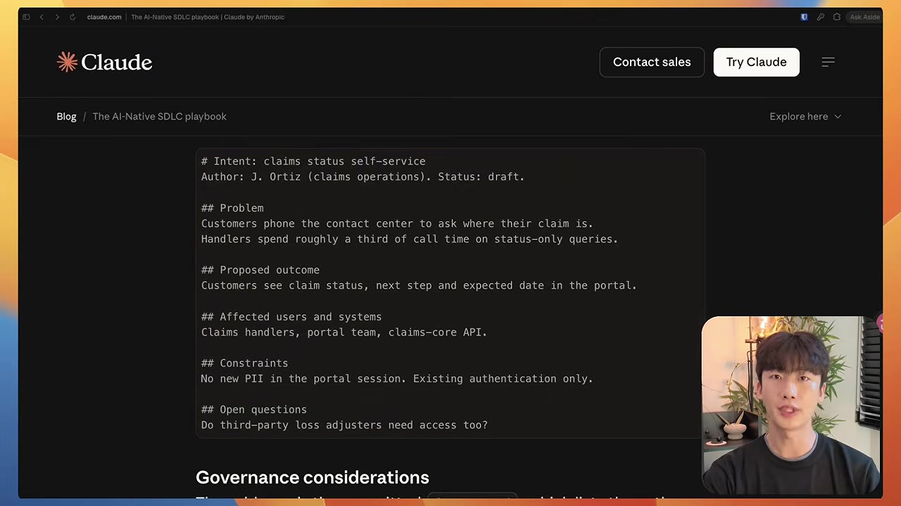
_01:30 — Anthropic 블로그 「The AI-Native SDLC playbook」에 실린 실제 `intent.md` 예시. 보험 청구 상태 셀프서비스 건으로, `## Problem` / `## Proposed outcome` / `## Affected users and systems` / `## Constraints` / `## Open questions` 5개 섹션과 상단에 Author·Status 메타데이터가 붙어 있다._

### 배치 위치

프로젝트 레포 루트에 `intent/` 폴더를 만들고 그 안에 쌓는다. Git 으로 버전 관리한다는 점이 핵심이다.

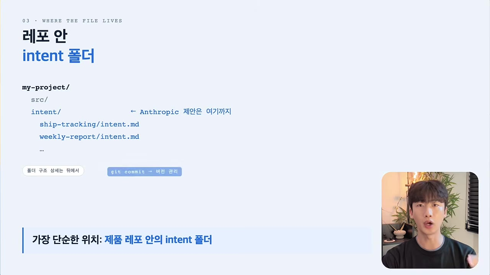
_02:15 — **"← Anthropic 제안은 여기까지"** 주석이 `intent/` 줄에 달려 있다. 즉 폴더 하나를 두고 `git commit` 으로 버전 관리하라는 것까지가 Anthropic 의 제안이고, 그 아래 구조는 각자 설계할 몫이다._

### 반드시 짚고 갈 오해 2가지 (02:41)

1. **Claude Code 가 자동으로 읽지 않는다.** `CLAUDE.md` 처럼 에이전트가 자동 인식하는 파일이 아니다. `CLAUDE.md` / `AGENTS.md` 에 "intent.md 를 읽어라"는 지시를 직접 넣어줘야 한다.
2. **정해진 포맷이 아니다.** 위 5개 섹션은 권장 사항일 뿐 업계 표준이 아니다.

---

## 2. 왜 지금인가 — 코드는 더 이상 병목이 아니다

### 기존 SDLC 의 전제

전통적인 SDLC(Plan → Design → Build → Test → Deploy → Maintain)는 **코드를 쓰고 구현하는 단계가 가장 오래 걸리고 가장 비싸던 시절**, 그 단계를 최대한 효율적으로 돌리려고 만들어진 구조다. 각 단계마다 담당자가 다르고, 기획 문서·티켓·특정 담당자의 컨펌으로 다음 단계로 넘어간다.

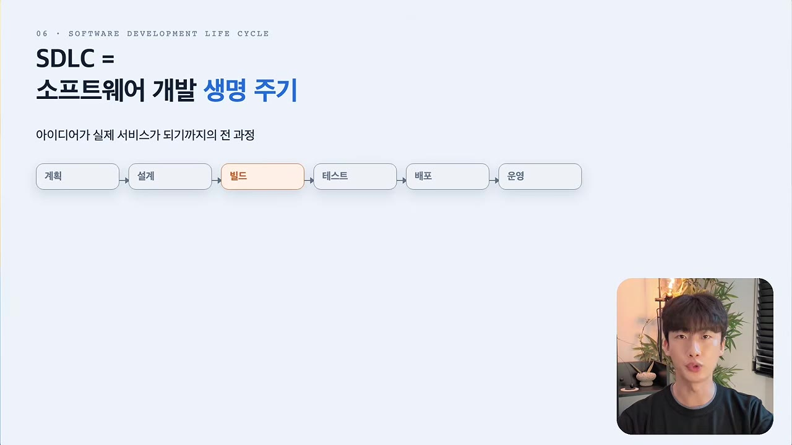
_04:35 — SDLC 정의. 계획 → 설계 → **빌드** → 테스트 → 배포 → 운영. 빌드 단계만 강조색으로 칠해져 있다._

PRD 작성, 스프린트 플래닝, 보안 리뷰 같은 앞단 작업이 무거웠던 이유도 **몇 주~몇 달짜리 개발이 이어질 것을 전제**했기 때문이다. 방향을 미리 맞춰두지 않으면 손실이 컸다.

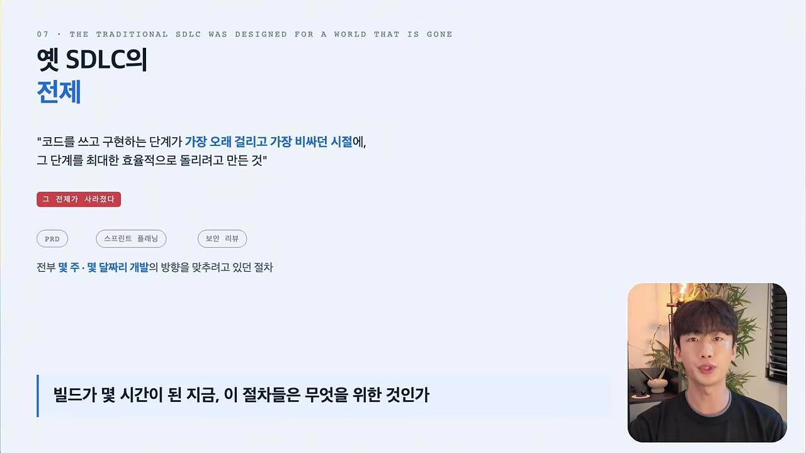
_05:35 — "코드를 쓰고 구현하는 단계가 가장 오래 걸리고 가장 비싸던 시절에, 그 단계를 최대한 효율적으로 돌리려고 만든 것" → **"그 전제가 사라졌다"**. 하단 질문: "빌드가 몇 시간이 된 지금, 이 절차들은 무엇을 위한 것인가"._

### 무너진 전제

에이전트가 들어오면서 Build 단계만 **몇 주·몇 달 → 몇 시간** 으로 압축됐다. 나머지 다섯 단계(Plan / Design / Test / Deploy / Maintain)는 여전히 사람 속도다. 결과적으로:

- 병목이 코드 작성에서 **그 앞뒤 절차**로 이동했다
- Build 에서 번 시간을 앞뒤 단계가 그대로 까먹는다

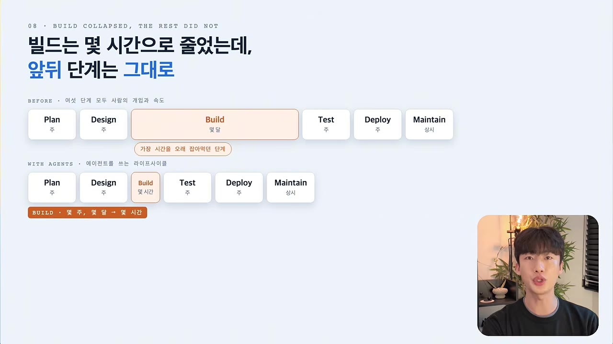
_06:15 — 영상 전체에서 가장 핵심적인 비교 그림. **BEFORE**(에이전트 이전)는 Build 박스가 압도적으로 길고 나머지가 짧다. **WITH AGENTS**(에이전트 이후)는 Build 만 "몇 시간"으로 쪼그라들었는데 **Plan·Design·Test·Deploy·Maintain 박스 길이는 그대로**다. 제목이 곧 결론이다 — "빌드는 몇 시간으로 줄었는데, 앞뒤 단계는 그대로"._

### 리뷰가 특히 깨진다 (06:49)

사람이 직접 타이핑하던 시절에는 라인바이라인 리뷰가 유효했다. 하지만 **diff 의 대부분을 에이전트가 생성**하면 그 방식은 유효하지 않다.

구체적 시나리오: 개발자 3명이 하루 종일 Claude Code 로 PR 을 수십 개씩 올린다. 그런데 리뷰어는 여전히 그 3명뿐이다. 결과는 둘 중 하나다.

- PR 머지 대기열이 계속 쌓인다
- 급하니까 대충 보고 머지한다

발표자는 2026년 6월에 이미 같은 문제를 지적한 적이 있다고 밝힌다 — **"코드는 남지만 의도는 남지 않아서, 코드 리뷰가 의도를 해석하는 작업이 되어버린다."** 이것이 `intent.md` 가 겨냥하는 정확한 지점이다.

---

## 3. AI 네이티브 SDLC — 직선에서 루프로

6개 단계(Plan / Design / Build / Test / Deploy / Maintain)는 전통 방식과 **동일하다.** 차이는 두 가지다.

| | 전통 SDLC | AI 네이티브 SDLC |
|---|---|---|
| 흐름 | 위에서 아래로 한 줄, 한 바퀴 = 릴리즈 1회 | 루프 |
| 에이전트 위치 | 없음 (Build 에만 보조) | 루프 **한가운데**, 모든 지점에 개입 |
| 단계별 산출물 | 사람이 손으로 쓴 문서 | 에이전트가 초안 생성 → 사람이 승인 |

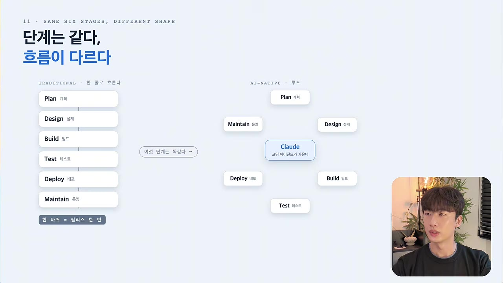
_09:00 — "단계는 같다, 흐름이 다르다". 왼쪽 **TRADITIONAL** 은 6개 박스가 위에서 아래로 한 줄(= 한 바퀴가 릴리즈 한 번). 오른쪽 **AI-NATIVE** 는 같은 6개 박스가 **Claude 를 가운데 두고 원형 루프**로 배치된다. 가운데 박스에 "모든 페이지의 기점"이라 적혀 있다._

### 단계별 변화

#### Plan (09:31)

- **기존**: 기획자가 대표·영업·CS 에게 요구사항을 받아 회의를 몇 번 돌리고 컨펌받아 Notion 에 손으로 기획서 작성
- **AI 네이티브**: 아이디어를 낸 사람이면 누구든(고객, CS 티켓 포함) Claude 와 대화하면서 `intent.md` 를 생성. 사람도 읽고 에이전트도 읽는 파일

#### Design (10:11)

- **기존**: 기획서 → 디자이너가 읽고 Figma 로 옮김 → 개발자가 Figma 보고 구현. **담당자를 넘길 때마다 해석이 한 번씩 들어간다**
- **AI 네이티브**: 기획자가 `intent.md` 를 던지면 Claude 와 한 세션 안에서 요구사항과 설계 스펙을 뽑음. 프론트엔드면 Claude Design 같은 도구로 목업까지. 회사 브랜딩·디자인 시스템 규칙은 **스킬**로 주입. 결과물도 레포에 커밋

#### Build (11:12)

- **기존**: 개발자가 직접 손으로 코드 작성
- **AI 네이티브**: 코드와 테스트를 에이전트가 생성. 병목이 **"우리 팀 규칙을 AI 가 잘 알고 있느냐"** 로 이동
  - 빌드·테스트 명령, 팀 컨벤션, 아키텍처 구조 → `CLAUDE.md` / `AGENTS.md` 등 룰 파일
  - 팀 전체에 똑같이 적용할 기준(예: API 구현 시 보안 리뷰) → **스킬**

#### Test (11:54)

- **기존**: 배포 후에야 신호가 옴. CI 는 몇 분 뒤, 테스트는 며칠 뒤
- **AI 네이티브**: Claude 가 작업 중 테스트 코드 작성 → 테스트 실행 → 빌드 → UI 작업이면 브라우저 띄워 스크린샷으로 검증까지. **모든 검증이 통과할 때까지 고친 다음에야** 사람 확인 단계로 넘어가도록 하네스를 세팅

이 단계의 구체적 장치 두 가지:

1. **TDD 룰 + 보호 훅** — 실패하는 테스트 먼저 → 통과하는 최소 코드 → 리팩터링. 단, 에이전트가 TDD 를 우회하려고 **테스트 코드 자체를 고쳐버리는** 경우가 있으므로, 구현 파일 편집 중에는 테스트 코드를 수정하지 못하게 protection hook 을 단다
2. **하네스 자체를 테스트한다** (13:17) — Anthropic 이 강조하는 지점. 코드만 테스트하는 게 아니라 **룰·스킬이 변경됐을 때 그 변경을 테스트**해야 한다
   - 예시: `.github/workflows/agent-eval.yml` 을 두고, `CLAUDE.md` 나 `.claude/` 하위 하네스가 변경되면 CI 가 돈다
   - 미리 정해둔 테스트 케이스를 **20~50개** 쌓아두고, 스킬이나 훅을 바꿀 때마다 에이전트가 여전히 같은 수준으로 일하는지 검증
   - 검증 예시: 최근 배포한 기능을 똑같이 구현시켰을 때 동일한 품질의 결과가 나오는가

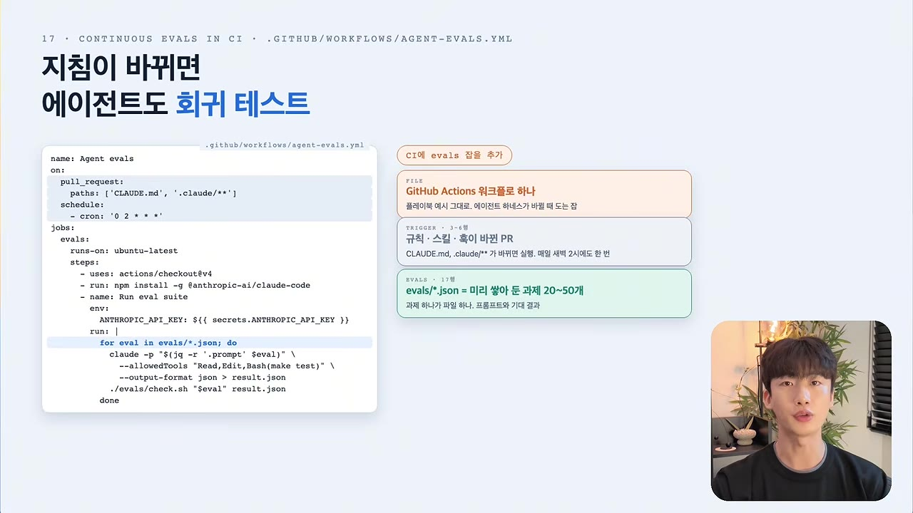
_14:15 — `.github/workflows/agent-evals.yml` 전문이 담긴 슬라이드. `on: pull_request: paths: ['CLAUDE.md', '.claude/**']` 로 **하네스 파일이 바뀐 PR에서만** 워크플로가 돈다. 오른쪽 주석 3개: "GitHub Actions 워크플로 하나 / 룰·스킬·훅이 바뀐 PR / evals\*.json = 미리 쌓아 둔 과제 20~50개"._

#### Deploy (14:19)

- **기존**: 사람이 PR 을 한 줄 한 줄 다 봄. 리뷰 품질이 리뷰어 컨디션에 따라 들쭉날쭉
- **AI 네이티브**: 에이전트 리뷰를 **여러 겹** 돌림. 사람은 결제·인증처럼 **위험한 코드만** 리뷰
- 보안·배포 정책 위반은 나중 리뷰 단계에서 잡는 게 아니라, **AI 가 파일을 편집하는 순간** 훅으로 잡는다

#### Maintain (15:01)

- **기존**: 새벽 알림은 놓치고, 티켓은 백로그에 묻히고, 장애 회고에서 나온 재발 방지 작업은 다른 불 끄느라 코드에 반영되지 않음
- **AI 네이티브**: 스크립트가 지표를 주기적으로 감시하다가 기준을 넘으면 에이전트를 호출
  - 감시 대상 예: CI 테스트 실패율, 배포 후 500 에러 발생량, PR 사이클
  - **중요**: 감지 로직은 최대한 **LLM 없이 결정론적으로**. 대응은 정도에 따라 로그만 남기기 → 읽기 전용 진단 → 실제 조치 순으로 **절차적으로 권한을 높여가도록** 설계
  - 그 외: 보안 스캔 도구를 붙여 주기적 레포 스캔, Slack 에 Claude 를 초대해두고 장애 요청이 오면 1차로 PR 생성
  - **장애 회고 자체를 마크다운으로 만들어 레포에 푸시**해 회고 히스토리를 관리

---

## 4. 산출물 체인 — 각 단계가 다음 단계가 읽을 것을 커밋한다

6단계 모두에서 Claude 가 **초안을 만들고**, 각 단계는 **다음 단계가 읽을 수 있는 결과물을 커밋**해 하나의 저장소에 쌓아나간다.

| 단계 | 산출물 | 초안 작성 | 승인 |
|------|--------|-----------|------|
| Plan | `intent.md` | 에이전트 | 사람 (PO) |
| Design | `spec.md` | 에이전트 | 사람 (PO) |
| Build | `plan.md` | 에이전트 (개발자가 완성) | 개발자 |
| Build | 코드 diff + 테스트 | 에이전트 | 개발자 |
| Deploy | 리뷰 기록 | 에이전트 다층 리뷰 | 사람 (위험 코드만) |
| Maintain | 장애 회고 md | 에이전트 | 사람 |

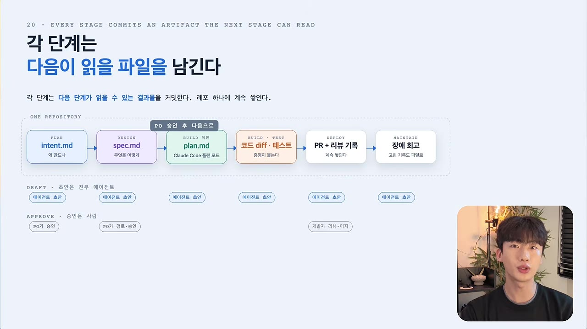
_18:25 — "각 단계는 다음이 읽을 파일을 남긴다". 왼쪽부터 `intent.md`(왜 만드나) → `spec.md`(무엇을 어떻게) → `plan.md`(Claude Code 플랜 모드) → 코드 diff·테스트 → PR + 리뷰 기록 → 장애 회고. 화살표 위에 **"PO 승인 후 다음으로"** 가 붙고, 아래 두 줄로 **DRAFT(초안은 전부 에이전트)** / **APPROVE(승인은 사람)** 가 단계별로 표시된다. 전부 **ONE REPOSITORY** 안이다._

**핵심 원칙 (18:29)**: 에이전트로 단계 진행 속도를 압축하되, **판단이 필요한 결정은 전부 사람이 책임지는 구조**여야 한다.

---

## 5. 파일 4종 비교 (22:18)

| 파일 | 답하는 질문 | 초안 작성자 | 승인·책임 주체 | 대체하는 것 |
|------|-------------|-------------|----------------|-------------|
| `CLAUDE.md` / `AGENTS.md` | AI 가 지켜야 할 규칙은 무엇인가 | — | 개발팀 | 팀 컨벤션 문서 |
| `intent.md` | **왜** 이 기능을 만드는가 | 에이전트 | **PO** | PRD, 스프린트 문서 |
| `spec.md` | **무엇을** 어떤 요구사항·설계로 만드는가 | 에이전트 | **PO** | 기획서, 설계 문서 |
| `plan.md` | **어떤 코드를 어떤 순서로** 바꾸고 무엇으로 검증하는가 | 에이전트 | **개발자** | 작업 티켓 |

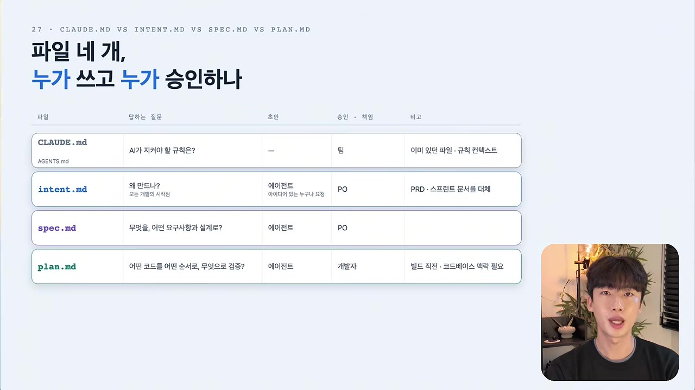
_24:00 — 슬라이드 원본 표. `CLAUDE.md`(팀, 규칙 컨텍스트) / `intent.md`(작성 에이전트, 승인 **PO**, PRD·스프린트 문서 대체) / `spec.md`(작성 에이전트, 승인 **PO**) / `plan.md`(작성 에이전트, 승인 **개발자**, "빌드 직전 · 코드베이스 맥락 필요")._

책임 주체가 갈리는 근거가 명확하다.

- `intent.md` / `spec.md` 는 단순 요구사항이 아니라 **회사 정책을 설계에 반영**하는 파일이다. 코드만 아는 사람이 아니라 **제품과 정책을 아는 PO** 의 몫이다
- `plan.md` 는 코드 작성 직전 단계이고 **코드베이스 맥락**이 필요하다. 개발자의 몫이다

> 자막에서 24:00 부근은 음성 인식 오류로 "스펙.md 는 개발자의 몫"처럼 들리는 구간이 있으나, 개발자 몫은 `plan.md` 다. 위 슬라이드 원본에서 `spec.md` 승인이 PO, `plan.md` 승인이 개발자로 표기된 것으로 확정된다.

---

## 6. 발표자가 설계한 전체 아키텍처 (24:42)

Anthropic 이 제안한 것은 `intent/` 폴더까지다. 그 아래 구조는 발표자의 설계이며, 두 가지 원칙을 세웠다.

1. **도구를 최소화한다** — GitHub, Slack, Claude **3개만** 사용. Jira, Confluence 등 외부 도구는 전혀 쓰지 않는다. Anthropic 도 이 방향을 권장한다
2. **SSOT(Single Source of Truth)** — 모든 지식의 원천을 한 곳에 몰아둔다. 전부 **하나의 레포지토리 안**에서 동작한다

### 흐름

```text
Slack 에서 Claude 태그 (기획자/CS/버그 티켓/장애 로그 누구든)
  ↓ 에이전트가 intent.md 초안 생성
intent 브랜치 → intent.md 하나만 담은 PR
  ↓ PO 검토 → PR 머지 = 승인
CI 잡 자동 실행
  ↓ 에이전트가 spec.md 초안 생성
spec 브랜치 → spec.md 하나만 담은 PR
  ↓ PO 검토 → PR 머지 = 승인
Slack 으로 담당 개발자에게 GitHub 멘션 알림
  ↓ 개발자가 로컬에서 Claude Code/Cursor/Codex 로
    intent + spec 기반 plan.md 생성·완성
에이전트 빌드 → 코드 생성 → 테스트 → 검증
  ↓
feature 브랜치 PR → 코드 리뷰 → 머지
```

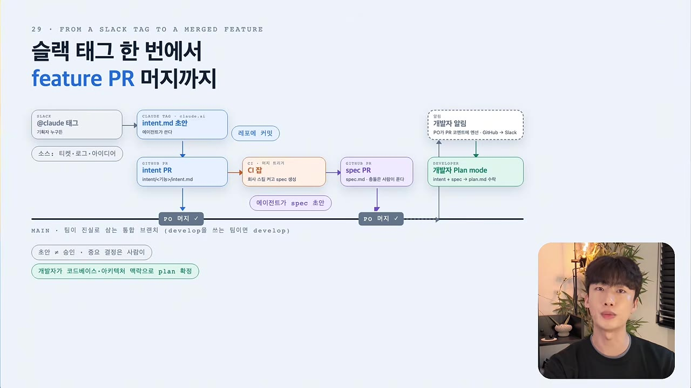
_28:50 — "슬랙 태그 한 번에서 feature PR 머지까지" 전체 흐름도. `@claude 태그`(소스: 티켓·로그·아이디어) → `intent.md 초안` → **intent PR**(intent/[슬러그]/intent.md 하나만) → 머지 → **CI 잡**(에이전트가 spec 초안) → **spec PR** → 머지 → 개발자 알림(GitHub + Slack) → **개발자 Plan mode**(intent + spec → plan.md 작성). 가로선이 `MAIN` 브랜치이고, **머지 지점 두 곳이 곧 사람의 승인 지점 두 곳**임을 하단 범례가 표시한다._

**"승인 = PR 머지"** 로 정의한 것이 이 설계의 요체다. 승인 절차를 별도 도구 없이 GitHub 안에서 끝내고, 승인 이력이 곧 Git 히스토리가 된다.

### 디렉터리 구조 (29:17, 33:08)

```text
project-root/
├── intent/
│   ├── <slug-1>/
│   │   ├── intent.md
│   │   ├── spec.md
│   │   └── plan.md
│   ├── <slug-2>/
│   │   ├── intent.md
│   │   ├── spec.md
│   │   └── plan.md
│   └── ...
├── src/
└── CLAUDE.md
```

- `intent/` 아래에 **의도 단위 슬러그 폴더**를 만든다
- 각 폴더 안에 `intent.md`, `spec.md`, `plan.md` **각 1개씩만** 둔다

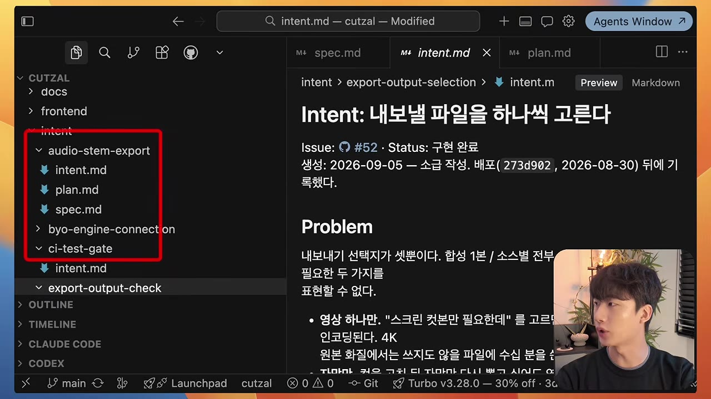
_30:05 — 발표자 실제 프로젝트(cutzal)의 에디터 화면. `intent/` 아래 `audio-stem-export/`, `byo-engine-connection/`, `ci-test-gate/`, `export-output-check/`, `export-output-selection/` 등 슬러그 폴더가 늘어서 있고, 각 폴더 안에 `intent.md`·`plan.md`·`spec.md` 3개가 들어 있다._

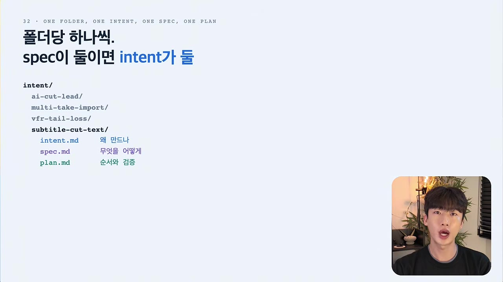
_33:40 — "폴더당 하나씩. spec 이 둘이면 intent 가 둘". 각 파일 옆에 역할이 한 단어로 붙어 있다 — `intent.md` 왜 만드나 / `spec.md` 무엇을 어떻게 / `plan.md` 순서와 검증._

**폴더당 1개 원칙 (33:29)**: 한 폴더에 spec 이 2개 필요해지면, spec 을 늘릴 게 아니라 **애초에 intent 를 2개로 쪼갰어야 하는지** 판단해야 한다. 큰 피처는 문서를 여러 개로 나누는 대신 **피처 자체를 작은 단위로 분리**하는 편이 의도 관리에 훨씬 효율적이다.

### 세 파일의 실제 내용 (30:30~33:15)

발표자가 자기 프로젝트의 파일을 직접 열어 보여준 화면이다. 템플릿이 아니라 **실제로 굴러가는 문서**라는 점에서 참고 가치가 있다.

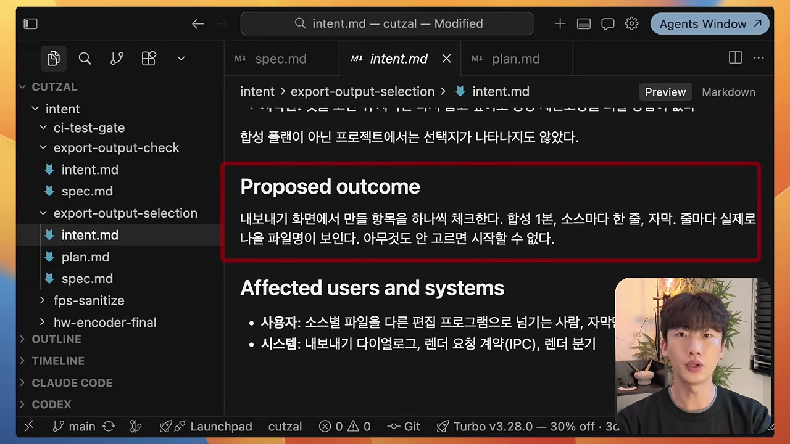
_30:30 — `intent.md`. 제목 아래에 **Issue 링크 · Status(구현 완료) · 생성일 · 커밋 해시**가 메타데이터로 붙어 있다. 본문은 `Problem` → `Proposed outcome`(내보내기 화면에서 만들 항목을 하나씩 체크) → `Affected users and systems`(사용자 / 시스템 구분) 순이다._

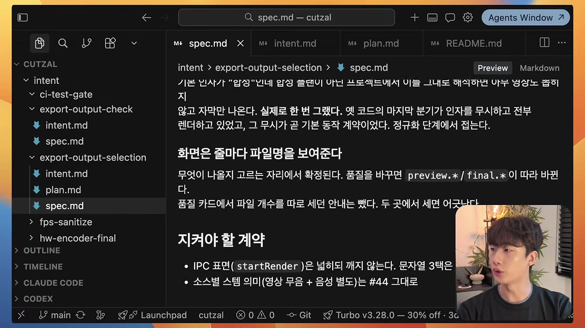
_31:05 — `spec.md`. "화면은 줄마다 파일명을 보여준다" 같은 **동작 규정**과 "지켜야 할 계약"(IPC 표면, 소스별 스템 의미) 섹션으로 구성된다. intent 의 "왜"가 여기서 "무엇을·어떤 계약으로"로 내려온다._

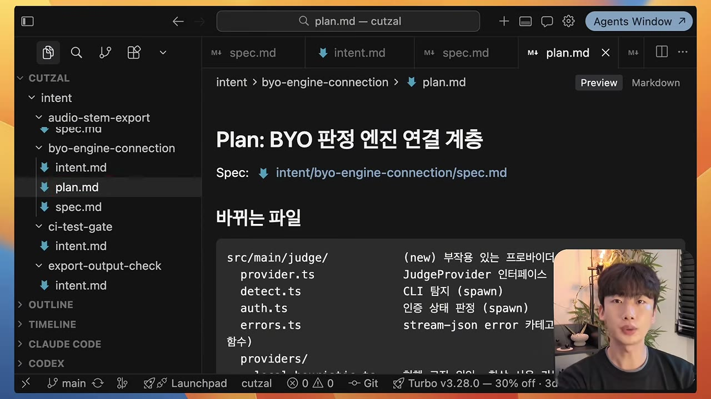
_33:15 — `plan.md`. 상단에 **대응하는 spec 파일 경로를 링크**로 걸어두고, `바뀌는 파일` 섹션에 `src/main/judge/` 아래 `provider.ts`(신규) · `detect.ts` · `auth.ts` · `errors.ts` 를 **파일 단위로 나열**하며 각각 무엇을 하는지 적어둔다. 코드베이스 맥락이 필요한 문서라는 점이 드러난다._

### PR 기반 승인 흐름 (31:35~32:35)

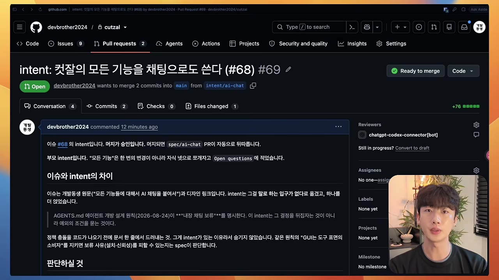
_31:35 — 실제 **intent PR**. 제목이 `intent: <의도 요약> (#68)` 형식이고, 본문에 "이슈 #68 의 intent 입니다. 머지가 승인입니다"라고 **승인 규약이 명시**되어 있다. 브랜치명은 `intent/ai-chat`._

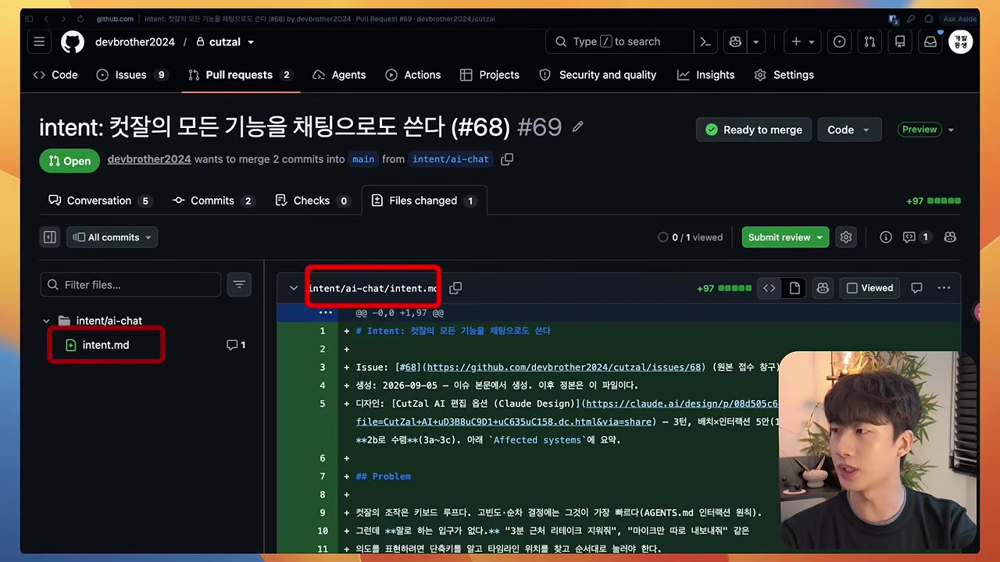
_31:50 — 같은 PR 의 **Files changed 탭**. 변경 파일이 `intent/ai-chat/intent.md` **하나뿐**이다. "intent.md 하나만 담은 PR" 원칙이 화면으로 확인되는 지점._

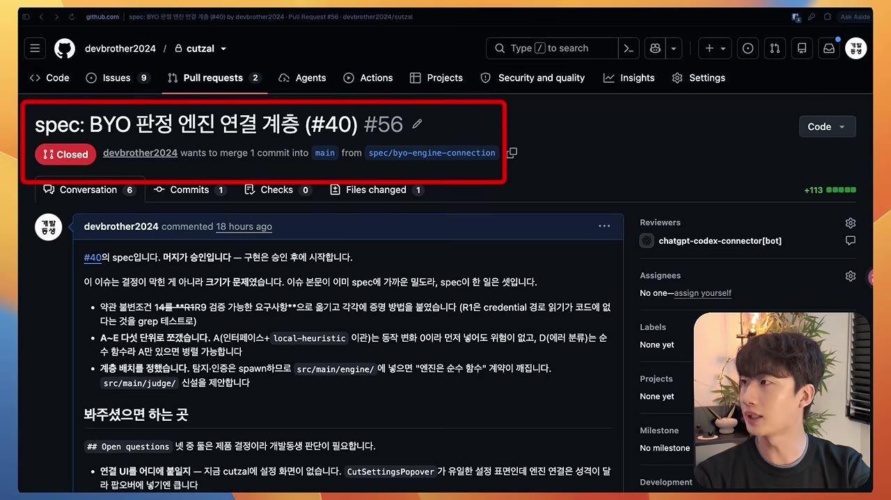
_32:35 — 이어지는 **spec PR**. 제목 `spec: <설계 요약> (#40)`, 브랜치 `spec/byo-engine-connection`, 커밋 1개. 본문이 "#40 에 spec 입니다. 머지가 승인입니다 — 구현은 승인 후에 시작합니다"로 시작해, **승인 전에는 코드를 쓰지 않는다**는 규약을 문서 자체에 박아두고 있다._

---

## 7. 도입 방법

### 1단계 — 가볍게 시작 (18:50)

`intent.md` 는 의도를 전달하는 파일이므로 **개발자가 쓰는 파일이 아니다.** 의도를 가진 사람이면 누구든 쓸 수 있는 구조를 만들어야 한다.

1. 템플릿 구조를 하나 만들어 전 구성원과 공유
2. Claude 에게 템플릿을 주고 "이 템플릿 기반으로 intent.md 를 작성해보자"
3. 의도를 그냥 설명하는 것만으로 시작 가능

발표자의 예시 대화:

> 사용자: "고객이 배송 상태를 자꾸 채팅으로 물어봐서 CS 시간이 낭비되고 있다"
> Claude: "배송 상태만 필요한가, 예상 도착일도 필요한가? 고객만 영향을 받나, 입점 판매자도 영향을 받나?"

이 되묻는 과정 자체가 의도를 명확하게 만드는 단계다.

**세팅해야 할 것은 두 가지뿐이다.**

- 코드베이스를 모르는 사람도 Slack 이나 템플릿으로 초안을 뽑을 수 있는 경로
- PO 가 그 초안을 수정·검토·승인하는 경로

그리고 팀 개발자 **한 명을 지정해 딱 한 번만** 이 시스템을 설계하면 된다.

### 2단계 — 이벤트 기반 자동화 (20:53)

사람 없이 초안까지 만들어지는 구조로 확장한다.

1. **이벤트 정의** — 티켓 등록됨 / Slack 채널에서 에이전트가 호출됨 / 특정 지표가 범위를 이탈함
2. 이벤트 발생 시 에이전트가 **진단하고 intent 초안을 자동 생성**
3. 승인은 여전히 PO 가 한다
4. 승인 완료 → 레포에 푸시 → Design 단계로 이어짐

### 언제 쓰지 *않아야* 하는가 (34:10)

- **오탈자 수정, 작은 버그 수정** — 무엇을 해야 하는지가 명확한 작업은 바로 고치는 게 효율적이다
- **혼자 개발하는 경우** — 큰 기능 단위를 시작할 때만 intent 를 먼저 쓴다
- **레거시 프로세스가 많은 조직** — 한 번에 다 바꾸려 하면 어렵다. 필요한 것만 하나씩 단계적으로 도입한다
- **Jira 등 외부 도구를 쓰는 조직** — 레포 하나에 다 모으지 않아도 된다. **결과물마다 원본이 어디 있는지 링크를 거는 것**부터 작게 시작해도 된다

---

## 8. 핵심 요약

1. **의도 전달이 중요해졌다.** 코드는 남지만 의도는 남지 않아서, 코드 리뷰가 의도 해석 작업이 되어버린다. `intent.md` 는 그 의도를 코드와 함께 버전 관리하겠다는 제안이다.
2. **모든 단계에 AI 를 넣되, 산출물은 초안이다.** 에이전트가 초안을 만들고 사람은 필요한 부분만 승인하는 시스템을 만든다.
3. **판단이 필요한 결정은 사람이 책임진다.** 속도는 압축하되 책임 구조는 유지한다.
4. **하네스 자체도 테스트 대상이다.** 룰·스킬·훅이 바뀌면 에이전트 품질이 유지되는지 CI 로 검증한다.
5. 업계 표준이 아니다. Anthropic 기업 도입 지원 팀의 현장 가이드다.

---

## 9. 본 프로젝트(claude-harness-hermes)와의 접점

이 영상의 주장 중 상당 부분은 본 프로젝트가 이미 다른 형태로 구현하고 있다. 겹치는 것과 비어 있는 것을 구분해 기록한다.

### 이미 구현되어 있는 것

| 영상의 주장 | 본 프로젝트의 대응 |
|-------------|--------------------|
| 단계별 산출물을 레포에 커밋해 쌓는다 | `docs/exec-plans/{backlog,active,completed}/`, `docs/design-docs/`, `docs/audits/` |
| 룰·스킬로 팀 규칙을 AI 에 주입 | `assets/rules/harness/rules.md` (R1~R7), `.claude/skills/` |
| 편집 순간에 위반을 훅으로 잡는다 | `scripts/hooks/claude-pretooluse-*.sh` (agent-guard, iface-guard, bash-guard) |
| 커밋 전 결정론적 게이트 | `.git/hooks/pre-commit` 4단 검사 + R-cx(순환 복잡도) + R-dep(의존 계층) |
| 장애·조사 회고를 마크다운으로 레포에 남긴다 | `docs/audits/YYYY-MM-DD-slug.md` |
| 감지 로직은 LLM 없이 결정론적으로 | 훅 전부 bash + AST 기반 정적 검사 |

### 대응이 비어 있는 것 (검토 후보)

1. **`intent.md` 계층 자체가 없다.** 본 프로젝트의 `docs/exec-plans/active/*.md` 는 영상의 `plan.md` 에 해당한다. 그 위의 **"왜"(intent)** 와 **"무엇"(spec)** 을 분리해 남기는 계층이 없다.
2. **하네스 자체에 대한 회귀 테스트(agent eval)가 없다.** 영상 13:17 이 강조하는 "룰·스킬 변경 시 에이전트 품질이 유지되는지 검증하는 CI 케이스 20~50개"에 해당하는 장치가 없다. 현재는 `tests/harness-hooks-smoke.sh` 수준의 스모크 테스트만 있고, 이 파일은 과거 silent-skip 사례가 있었던 대상이기도 하다.
3. **비개발자 진입 경로가 없다.** intent 초안을 코드베이스를 모르는 사람이 Slack 등에서 만들 수 있는 경로가 설계되어 있지 않다. 다만 본 프로젝트는 단독 개발 성격이므로 우선순위는 낮다.

> 위 3항목은 **후보일 뿐 결정이 아니다.** 채택 여부는 별도 exec-plan 에서 판단한다. 특히 1번은 이미 있는 `docs/exec-plans/` 체계와 중복될 수 있어, 도입한다면 새 계층을 추가하는 게 아니라 **기존 템플릿에 "왜" 섹션을 강화**하는 방향이 더 적절할 수 있다.

---

## 부록 — 확인 방법과 한계

- 자막: yt-dlp 로 받은 **한국어 자동 생성 자막**(원본 언어 `ko`, 수동 자막 없음). 전체 36:57 분량 108블록을 모두 읽었다. 원문을 함께 보관한다.
  - [`transcript.ko.vtt`](./transcript.ko.vtt) — yt-dlp 가 받은 원본 WebVTT (무가공)
  - [`transcript.ko.txt`](./transcript.ko.txt) — 중복 행 제거 후 20초 단위로 묶은 108블록 (`[MM:SS] 본문` 형식)
- 스크린샷: `screenshots/` 에 18장. 자막에서 화면을 지시하는 표현("지금 보이는 이 포맷", "이런 식으로", "보여 드리도록")이 나오는 지점을 먼저 추려낸 뒤, 해당 구간의 프레임을 확인해 **슬라이드 애니메이션이 완성된 시점**을 골라 720p 원본 해상도로 캡처했다. 파일명의 숫자는 `순번-MMSS-내용` 이다.
- 영상 다운로드 경위: 설치된 yt-dlp(2026.06.09)는 JS 런타임 문제로 모든 클라이언트에서 HTTP 403 을 반환했다. `node`/`bun` 을 `--js-runtimes` 로 지정해도 android_vr 로 폴백해 실패했고, 최신 yt-dlp(2026.08.19)를 **임시 디렉터리에 격리 설치**(`pip install --target`, 사용자 환경 미변경)하니 visionos 클라이언트로 720p 스트림을 받을 수 있었다.
- 자동 자막 특성상 고유명사 표기 오류가 있다 (Anthropic→"엔트로픽", PR→"피아/피하", CI→"C", GitHub→"기터브", Jira→"지라", 500 error→"500일러"). 본 문서에서는 문맥으로 복원해 표기했다.
- 캡션 텍스트는 자막(음성)에서, 슬라이드 안의 문구는 스크린샷에서 각각 확인해 교차 검증했다. 다만 각 스크린샷 캡션의 세부 문구는 **480~560px 축소본으로 판독한 것**이므로, 정확한 원문이 필요하면 원본 이미지를 직접 열어 확인해야 한다.
