# 하네스 안의 모델 라우터 — LangChain 의 "비용 64% 절감" 실험

> 작성일: 2026-10-07
> 목적: YouTube 영상 「How to Build a Model Router in the Harness」(LangChain)의 전체 내용과 실험 수치를 정리하고, "품질 그대로 64% 절감"이라는 요약이 어디까지 맞는지와 본 프로젝트(claude-harness-hermes)와의 접점을 기록한다.

## 개요

| 항목 | 내용 |
|------|------|
| 제목 | How to Build a Model Router in the Harness |
| 채널 | LangChain |
| 발표자 | Sydney Runkle (LangChain 오픈소스팀 PM). 표지에는 Eugene Yurtsev 공동 표기 |
| 게시일 | 2026-10-06 |
| 길이 | 13분 39초 (819초) |
| URL | <https://www.youtube.com/watch?v=5kTFyEOgark> |
| 동반 글 | <https://www.langchain.com/blog/how-to-build-a-model-router-in-the-harness> |
| 실험 대상 | Open SWE — LangChain 의 오픈소스 코딩 에이전트 (<https://github.com/langchain-ai/open-swe>) |

영상은 코딩 에이전트에 **모델 라우터**(작업을 보고 싼 모델·중간 모델·비싼 모델 중 하나를 고르는 장치)를 넣는 과정을 4단계로 설명하고, 실사용 트래픽을 반으로 나눈 A/B 테스트 결과를 보여 준다.

> **주의**: 널리 퍼진 요약 "품질은 그대로, API 비용 64% 절감"은 영상의 가장 유리한 숫자다. 64% 는 **중앙값**이고 평균은 42% 다. "품질 그대로"는 **차이를 찾지 못했다**는 뜻이지 동등함을 입증한 것이 아니다. 자세한 것은 [5절](#5-걸러-들어야-할-부분).

### 타임라인

| 시각 | 내용 |
|------|------|
| 00:00 | 최상위 모델은 규모가 커지면 비싸다 |
| 01:24 | 모델 라우터가 하는 일 |
| 01:56 | 결과 예고 — 스레드당 비용 중앙값 64% 감소 |
| 02:10 | 라우터를 만드는 4단계 |
| 02:40 | 1단계 — LangSmith 트레이스로 작업 분포 파악 |
| 04:53 | 2단계 — 파레토 프런티어 위에서 모델 고르기 |
| 05:59 | 3단계 — 하네스 안에 라우터 만들기 |
| 06:49 | 분류기를 Jev 로 교체 |
| 07:23 | 빠름 단계에 오픈 모델이 맞는 이유 |
| 07:46 | 4단계 — 평가 세트 또는 A/B 테스트로 결과 추적 |
| 08:49 | 실험 1 결과 |
| 10:14 | 실험 2 를 하루 만에 중단한 이유 |
| 10:45 | 다음 과제 — 벤치마크·서브에이전트·스레드 중간 재라우팅 |
| 12:30 | 내 에이전트에 라우터 넣는 법 |

## 1. 문제 제기 — 모든 작업에 최상위 모델이 필요하지는 않다

- 최상위 모델은 비싸고, 에이전트를 대규모로 돌리면 비용이 감당하기 어려워진다.
- 발표자는 Anthropic 의 모델 선택 가이드를 인용한다: "많은 애플리케이션에서 Claude Haiku 4.5 같은 더 빠르고 비용 효율적인 모델로 시작하는 것이 최적일 수 있다."

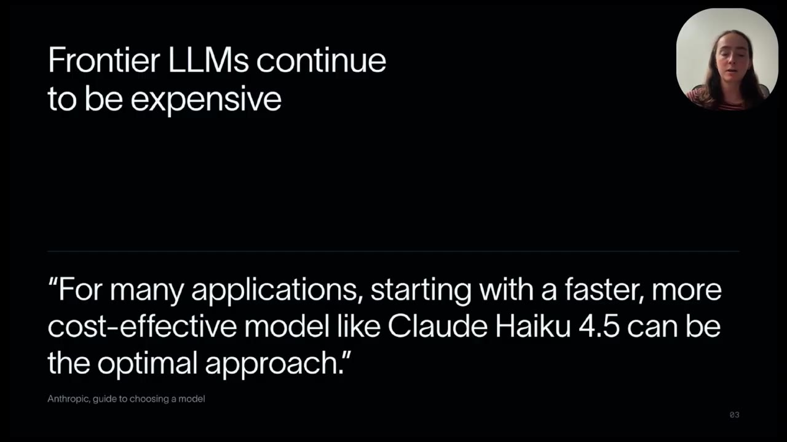

- 어느 지점을 넘으면 비용과 지연은 늘어나는데 결과 품질은 거의 좋아지지 않는다(수확 체감).
- 좋은 에이전트는 **모델–하네스–작업의 궁합**(model-harness-task fit)이 맞는다. 작업에 맞는 모델을 고르고, 하네스가 그 모델에 맞는 맥락을 넣어 준다는 뜻이다.

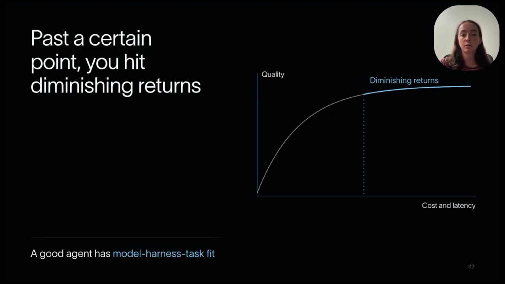

## 2. 모델 라우터가 하는 일 (01:24)

작업 요청이 들어오면 라우터가 한 번 분류하고, 고른 모델이 그 작업을 끝까지 수행한다. 라우터는 세 가지로 이루어진다.

- 기본 프롬프트
- 단계별 기준 (어떤 작업을 어느 단계로 보낼지)
- 분류기 모델

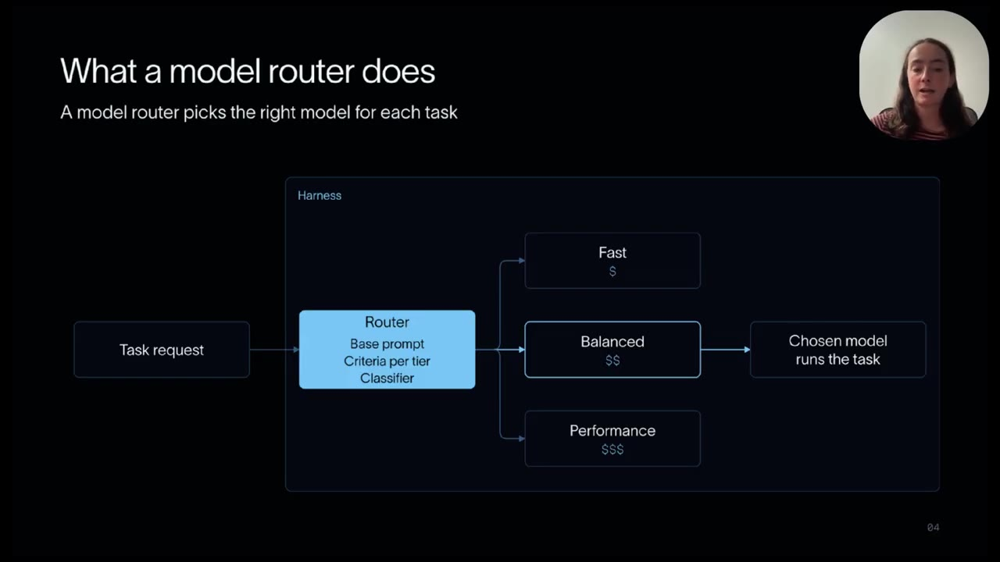

## 3. 만드는 4단계

### 1단계 — 작업 분포를 파악한다 (02:40)

발표자가 **4단계 중 가장 중요하다**고 꼽은 단계다. 작업 분포를 모르면 라우팅 기준을 세울 수 없다.

Open SWE 는 실행할 때마다 LangSmith 에 트레이스(에이전트가 밟은 모든 단계의 기록)를 보낸다. 이것을 집계해 1주일치 대화형 스레드를 유형별로 나눴다.

| 유형 | 비중 |
|------|------|
| 기능 (Feature) | 21.7% |
| 버그 수정 | 17.1% |
| 테스트·빈 실행 (Test / no-op) | 15.6% |
| 기타 | 14.9% |
| 릴리스·운영 | 8.0% |
| 설계 | 6.2% |
| 진단 | 6.0% |
| PR 관리 | 5.1% |
| 질문 | 2.9% |
| 리뷰 | 2.4% |

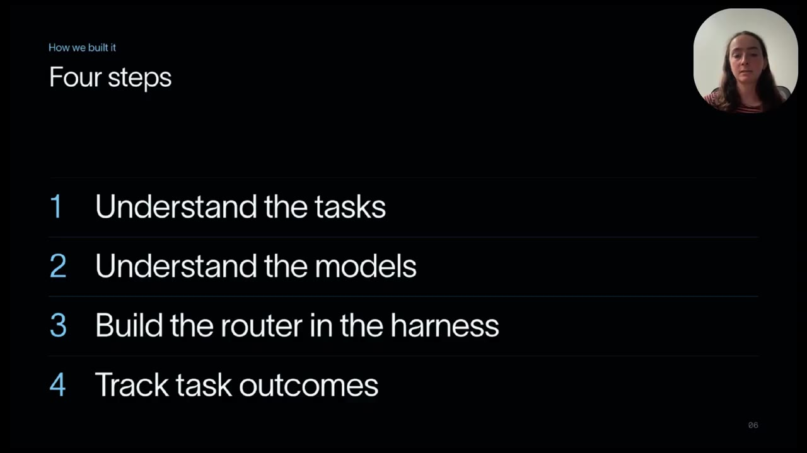

발표자는 LangSmith 위에 직접 만든 분석 화면도 보여 준다. 유형별 스레드 수, 활성 시간(P50·P75), 호출 수를 표로 본다. 예를 들어 활성 시간 P50 은 기능 11.2분, 버그 수정 7.6분, 테스트·빈 실행 1.8분이다.

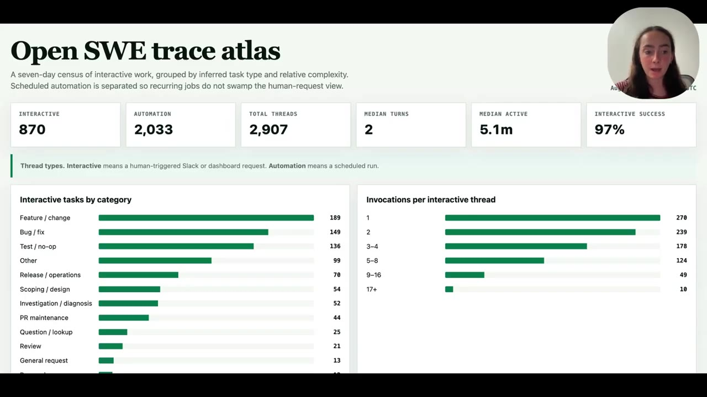

다음으로 유형별 복잡도를 쟀다. 호출 수(Open SWE 가 불린 횟수)나 LLM 비용이 높으면 더 복잡한 작업으로 봤다. 상위 6개 유형, 8월 29일~9월 5일 기준이다.

| 유형 | 스레드 | 호출 중앙값 | LLM 비용 중앙값 | 복잡도 낮음 / 중간 / 높음 |
|------|--------|-------------|-----------------|---------------------------|
| 기능 작업 | 189 | 3 | $3.28 | 13% / 35% / 52% |
| 버그 수정 | 149 | 2 | $2.05 | 16% / 48% / 36% |
| 테스트·빈 실행 | 136 | 1 | $0.52 | 74% / 20% / 6% |
| 릴리스·운영 | 70 | 2 | $0.88 | 31% / 51% / 17% |
| 범위·설계 | 54 | 3 | $1.75 | 17% / 35% / 48% |
| 조사 | 52 | 3 | $3.42 | 13% / 42% / 44% |

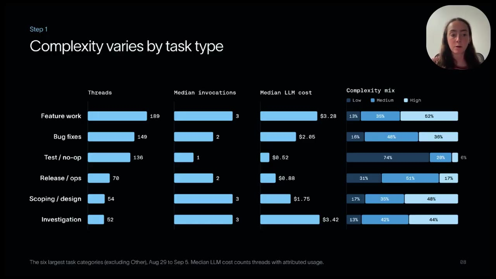

테스트·빈 실행의 74% 가 낮은 복잡도다. 이 덩어리가 싼 모델로 보낼 수 있는 몫이다.

### 2단계 — 파레토 프런티어 위에서 모델을 고른다 (04:53)

Artificial Analysis Intelligence Index(2026-09-09 기준)에서 가로축을 작업당 비용, 세로축을 지능 지수로 놓고, 비용 대비 성능이 가장 좋은 모델들의 경계선(파레토 프런티어) 근처에서 세 개를 골랐다.

| 단계 | 모델 (추론 설정) | 지수 작업당 비용 |
|------|------------------|------------------|
| 빠름 | GLM-5.3-Flash | 약 $0.26 |
| 균형 | GPT-5.6 Sol (medium) | 약 $0.50 |
| 성능 | GPT-6 Astra (low) | 약 $0.82 |

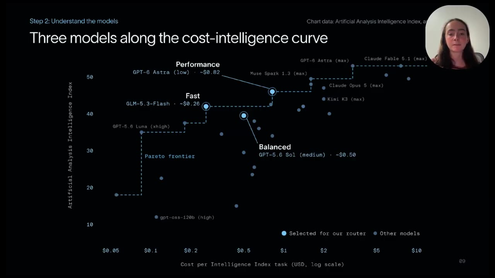

- 빠름 단계의 GLM-5.3-Flash 는 오픈 모델이다. 발표자는 라우터가 싸고 빠른 오픈 모델을 시험해 볼 좋은 자리라고 말한다(07:23).
- 차트에서 균형 모델의 점은 빠름 모델보다 비싸면서 지능 지수는 더 아래에 찍혀 있다. 차트를 눈으로 읽은 값이고, 영상은 이 선택의 이유를 설명하지 않는다.

### 3단계 — 하네스 안에 라우터를 만든다 (05:59)

기준은 두 가지 자료로 세웠다. 1단계에서 파악한 작업 분포, 그리고 모델 제공사의 공식 가이드(어느 모델을 어느 작업에 쓸지)다.

| 단계 | 모델 | 보내는 작업 (슬라이드 발췌) |
|------|------|------------------------------|
| 빠름 | GLM-5.3-Flash | 단순 조회, 상태 확인, 테스트·로그 수집 |
| 균형 | GPT-5.6 Sol | 일반 버그 수정, 범위가 정해진 조사, 여러 파일 구현 |
| 성능 | GPT-6 Astra | 아키텍처·설계, 새로운 근본 원인 추론, 위험이 큰 결정 |

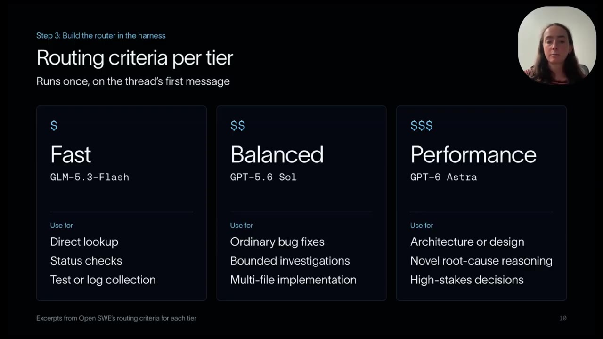

- 라우터는 **스레드의 첫 메시지에서 한 번만** 돈다. 고른 모델이 스레드 끝까지 간다. 대화 도중에 모델을 바꾸는 방식은 쓰지 않았다.
- 동반 글에 따르면 기준은 "작업을 끝낼 수 있을 것 같은 가장 싼 모델을 고른다"이다.
- 분류기는 처음에 GLM-5.3-Flash 에 구조화 출력을 시켜 만들었다. 실험이 끝난 뒤 결정 전용 모델 Jev 로 바꿨고, 동반 글은 분류가 약 50배 빨라졌다고 적는다(06:49). **실험 수치는 교체 전 분류기로 얻은 것이다.**

### 4단계 — 결과를 추적한다 (07:46)

| 방법 | 장점 | 단점 |
|------|------|------|
| 오프라인 평가 | 안전하고 반복 비교 가능 | 실제 트래픽을 닮은 데이터 세트를 만들기 어렵고 비쌈 |
| A/B 테스트 | 실사용 트래픽이라 대표성이 있음 | 사용자가 덜 다듬어진 라우터를 겪을 수 있음 |

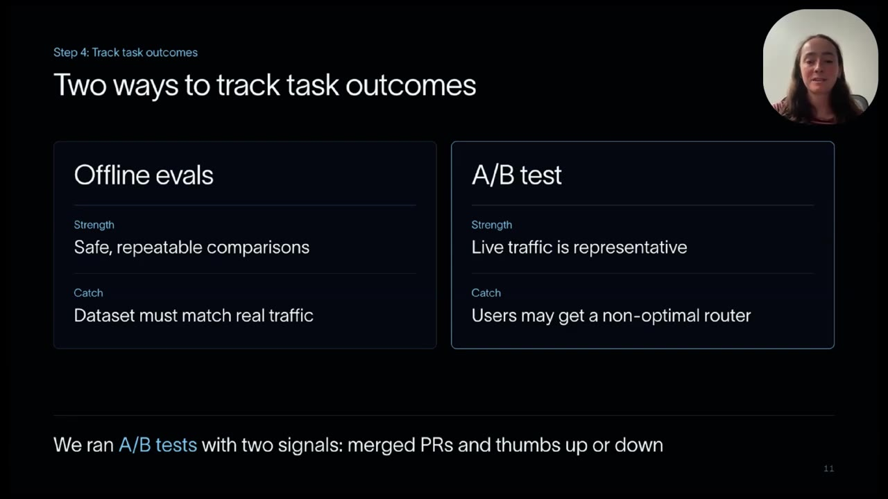

LangChain 은 A/B 테스트를 골랐고 두 신호를 봤다. 병합된 PR 비율, 그리고 사용자가 누르는 좋아요·싫어요다.

## 4. 실험 결과

### 실험 1 — 라우터 대 항상 성능 모델 (08:49)

2026년 9월 16~22일, 총 973개 스레드. 절반은 라우터, 절반은 항상 GPT-6 Astra 로 보냈다.

| 항목 | 항상 Astra | 라우터 | 차이 | p 값 |
|------|-----------|--------|------|------|
| 스레드 수 | 477 | 496 | — | — |
| 스레드당 비용 중앙값 | $2.61 | $0.94 | −64% | — |
| 스레드당 비용 평균 | $4.76 | $2.75 | −42% | — |
| 스레드당 비용 P90 | $11.07 | $6.93 | −37% | — |
| 병합된 PR 로 끝난 스레드 | 27.3% | 29.2% | +2.0%p | 0.49 |
| PR 생성 비율 | 39.6% | 38.9% | −0.7%p | 0.82 |

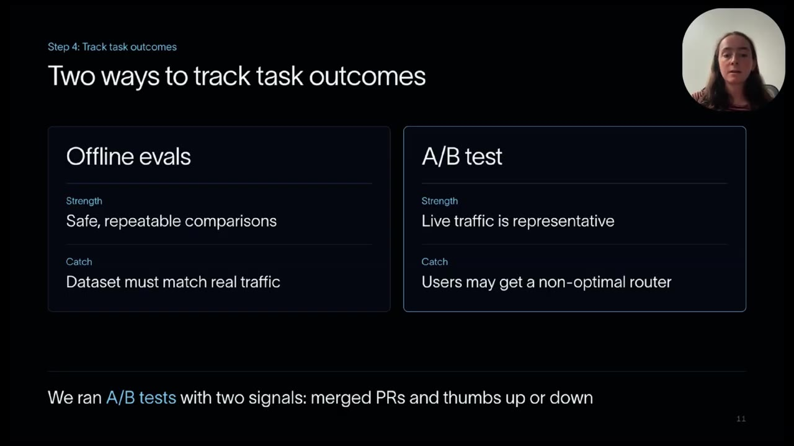

라우터 쪽 496개 스레드가 단계별로 나뉜 모습이다.

| 단계 | 스레드 | 비중 | 스레드당 비용 중앙값 |
|------|--------|------|----------------------|
| 빠름 | 167 | 34% | $0.097 |
| 균형 | 279 | 56% | $1.50 |
| 성능 | 50 | 10% | $2.88 |

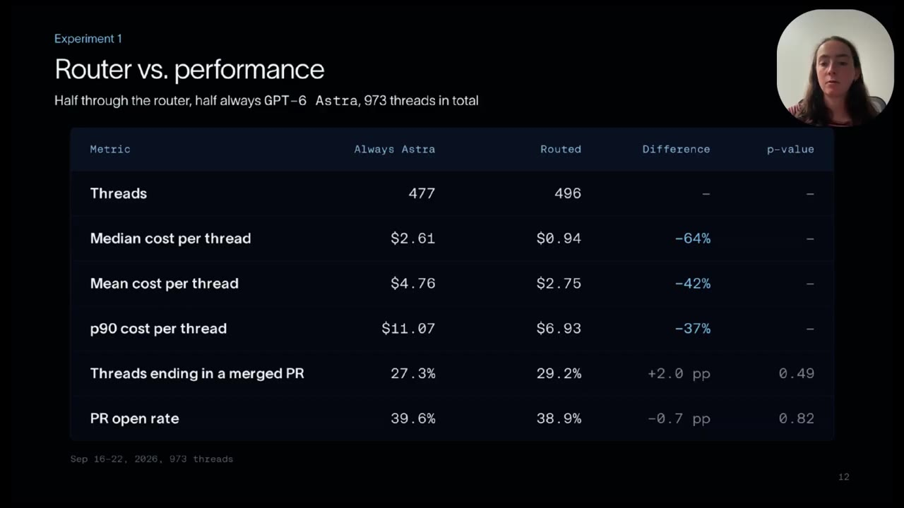

- 성능 모델이 필요하다고 분류된 요청은 10% 뿐이었다.
- 빠름과 성능 단계의 비용 중앙값은 약 30배 차이다.
- 아주 긴 스레드 몇 개가 비용을 불균형하게 차지했다. 라우터 쪽과 대조 쪽 모두 같았다(10:03).

### 실험 2 — 라우터 대 항상 빠른 모델 (10:14)

**하루 만에 중단했다.** 빠른 모델에 고정된 사용자들의 불만이 너무 많아 사용 경험을 더 망가뜨리지 않기로 했다. 통계적으로 의미 있는 결과는 나오지 않았다. 발표자는 "Open SWE 의 모든 작업을 GLM-5.3-Flash 로 돌릴 수는 없다는 것이 분명했다"고 말한다.

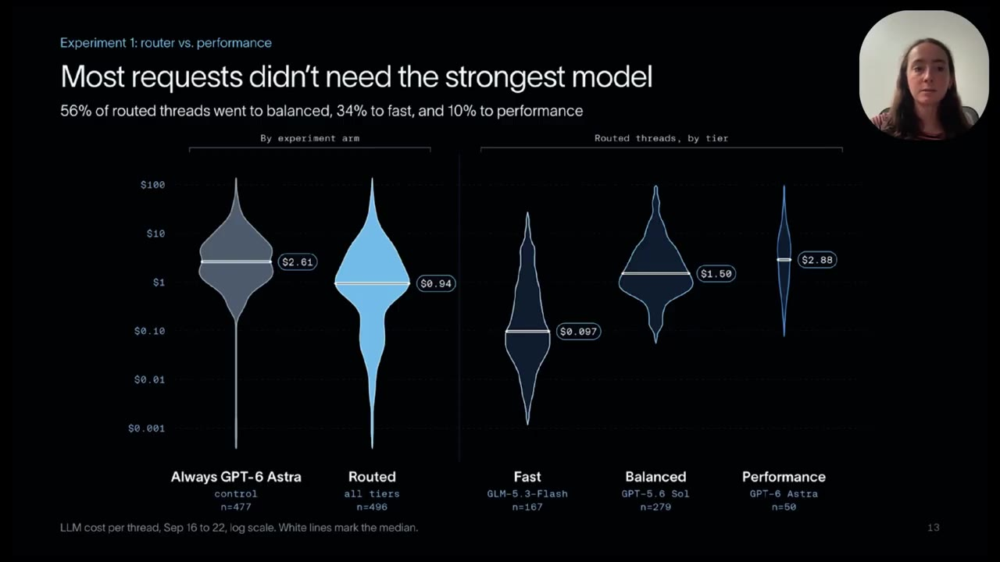

## 5. 걸러 들어야 할 부분

영상 내용은 사실이지만 "품질은 그대로, 비용 64% 절감"이라는 한 줄 요약에는 빠진 것이 있다.

1. **64% 는 중앙값이다.** 실제 청구액에 가까운 평균은 42%, P90 은 37% 감소다. 긴 스레드가 비용을 지배하기 때문에 중앙값이 가장 크게 나온다.
2. **"품질 그대로"는 입증이 아니다.** 한쪽당 약 490개 스레드에서 병합 PR 비율의 유의한 차이를 찾지 못했다는 뜻이다(p=0.49). 동등함을 보이도록 설계한 검정이 아니다.
3. **품질 신호가 사실상 하나다.** 좋아요·싫어요는 발표자 스스로 "많이 받지 못했다"고 말한다(12:19). 남는 것은 병합 PR 비율뿐이다.
4. **비교 기준이 가장 비싼 구성이다.** 모든 작업을 성능 모델로 보내던 상태와 비교했다. 이미 작업별로 모델을 나눠 쓰는 곳이라면 절감 폭은 더 작다.
5. **라우터의 성능 단계는 낮은 추론 설정(low)이다.** 모델 선정 차트에 `GPT-6 Astra (low)` 로 적혀 있다. 대조군("항상 Astra")의 추론 설정은 영상에 따로 나오지 않는다.
6. **싼 모델 고정은 실패했다.** 실험 2 가 보여 주는 것은 "싼 모델로 다 된다"가 아니라 "분류가 있어야 싼 모델을 쓸 수 있다"이다.
7. **한 회사의 한 에이전트, 1주일치 결과다.** 작업 분포가 다른 곳에서는 숫자가 달라진다. 영상이 1단계(자기 작업 분포 측정)를 가장 중요하다고 한 이유이기도 하다.

## 6. 발표자가 밝힌 다음 과제 (10:45)

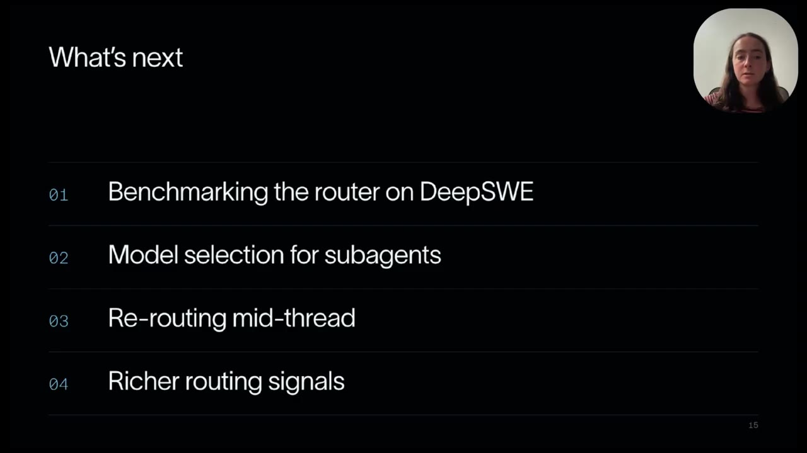

1. **DeepSWE 등 고정 벤치마크로 라우터 평가.** A/B 테스트만으로는 부족하다. Open SWE 의 일은 리뷰하기 좋은 PR 을 만드는 것이라 리뷰 중심 벤치마크도 후보다.
2. **서브에이전트의 모델 선택.** 주 에이전트가 부리는 서브에이전트에도 크기가 맞는 모델을 고르면 비용을 더 줄일 수 있다. 이번 실험은 손대지 않았다.
3. **스레드 중간 재라우팅.** 질문으로 시작했다가 복잡한 버그 수정으로 번지면 더 강한 모델로 올린다. 모델을 바꾸면 프롬프트 캐시가 깨지는 비용이 있다. 다만 Open SWE 같은 비동기 에이전트는 사람이 답하기까지 5분 넘게 걸려 어차피 캐시가 자주 깨지므로 큰 문제가 아닐 수 있다(11:50).
4. **더 풍부한 라우팅 신호.** 트레이스에 붙는 사용자 평가가 적었다. 동반 글은 사용자 감정 분석 등을 후보로 든다.

## 7. 발표자의 권고 (12:30)

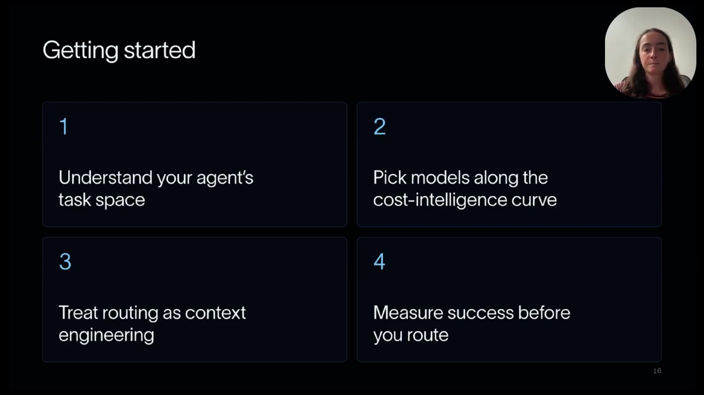

1. 에이전트의 작업 분포를 파악한다.
2. 비용–지능 곡선 위에서 모델을 고른다.
3. 라우팅을 맥락 설계(context engineering)로 다룬다. 작업에 대한 맥락이 있는 곳, 곧 하네스 안에 라우터를 둔다.
4. **실제 라우팅을 켜기 전에** 성공을 잴 수단부터 갖춘다.

LangChain 은 이 기능을 모델 라우팅 미들웨어로 제공한다. 새 모델을 쓰려면 에이전트를 다시 짜는 것이 아니라 단계 하나를 갈아 끼우면 된다는 것이 슬라이드의 문구다.

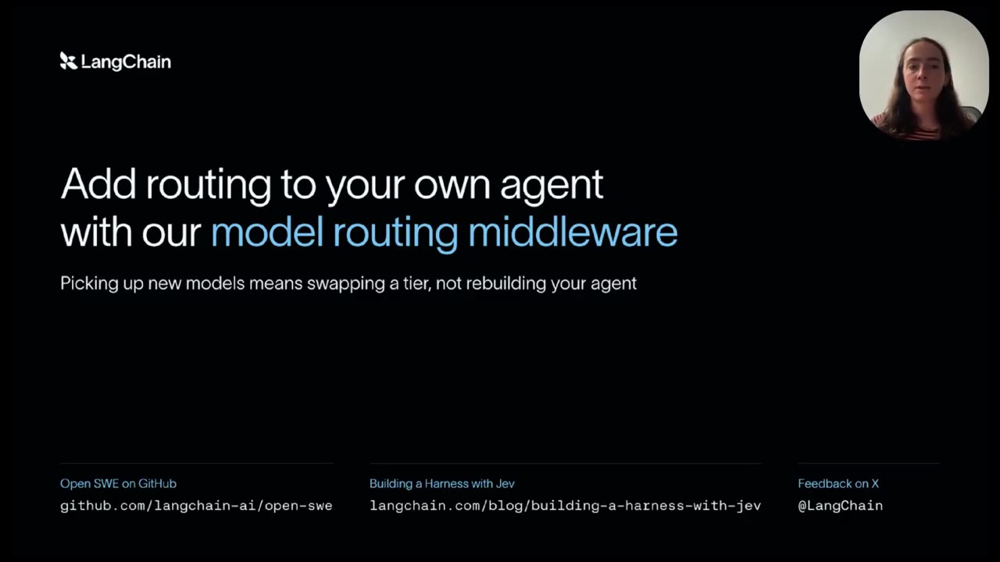

## 8. 핵심 요약

- 코딩 에이전트 요청의 90% 는 최상위 모델이 필요 없다고 분류됐다(빠름 34%, 균형 56%, 성능 10%).
- 비용은 중앙값 64%, 평균 42% 줄었고, 병합 PR 비율에서 유의한 차이는 나오지 않았다.
- 싼 모델 하나로 통일하는 것은 하루 만에 실패했다. 절감은 **분류**에서 나온다.
- 순서가 중요하다. 작업 분포를 재고, 결과를 잴 수단을 갖춘 뒤에 라우팅한다.

## 9. 본 프로젝트(claude-harness-hermes)와의 접점

### 이미 구현되어 있는 것

| 영상의 주장 | 본 프로젝트의 대응 |
|-------------|--------------------|
| 가벼운 분류·요약은 싼 모델로 | 배경 LLM 호출 9개 스크립트가 `claude-haiku-4-5-20251001` 로 고정 (`hermes-summarize` · `hermes-crystallize` · `hermes-dream` · `hermes-evolve-skill` · `hermes_search_fallback` · `hermes_privacy_judge` · `hermes_persona_extract` · `hermes_mesh_gate` · `harness-eval`) |
| 역할에 맞는 크기의 모델 | 에이전트 frontmatter 의 `model:` — 13종 중 opus 2(`architect` · `planner`), haiku 1(`doc-updater`), sonnet 10 |
| 싼 단계에서 시작해 필요하면 올린다 | R7 의 `architect-lite` → `architect`, `planner-lite` → `planner` 승격 (사람이 승인) |
| 작업 모양으로 모델을 고른다 | `~/.claude/rules/common/performance.md` 의 모델 선택 표 (사람·에이전트가 읽는 규칙) |

### 대응이 비어 있는 것 (검토 후보)

1. **관측이 없다 — 영상의 1단계.** 어느 에이전트가 어느 모델로 불렸는지 기록이 남지 않는다. `docs/exec-plans/backlog/agent-model-routing-blindspot.md` 가 이 문제이고, `platform-cost-performance-levers.md` 는 2026-10-03 기준 "R-out 이벤트에 에이전트는 남지만 모델은 아직 안 남는다"고 적는다. 영상이 가장 중요하다고 한 단계가 본 프로젝트의 미충족 항목과 같다.
2. **모델 배정이 정적이다.** 에이전트의 모델은 frontmatter 에 고정되어 있어, 같은 에이전트가 쉬운 일을 받아도 같은 모델로 돈다. 작업 내용을 보고 고르는 분류 단계는 없다.
3. **모델을 바꿨을 때 품질을 재는 수단이 없다 — 영상의 4단계.** `harness-eval` 은 훅·가드가 행동을 막는지 재는 도구이고, 모델 단계를 내렸을 때 결과가 유지되는지 비교하는 용도가 아니다.

### 그대로 옮길 수 없는 것

- **비용 단위가 다르다.** 영상의 달러 절감은 API 과금 기준이다. 본 프로젝트는 R3 에 따라 모든 LLM 호출이 구독 CLI 를 거치므로, 절감은 달러가 아니라 사용 한도와 시간으로 나타난다.
- **LangChain 미들웨어는 대상이 아니다.** 같은 이유(R3)로 API 기반 미들웨어를 들여올 수 없다. 가져올 것은 도구가 아니라 순서(측정 → 단계 정의 → 분류 → 결과 추적)다.

> 위 항목은 **후보일 뿐 결정이 아니다.** 채택 여부는 별도 exec-plan 에서 판단한다. 영상의 권고대로라면 2·3번보다 1번(관측)이 먼저다. 관측 없이 모델을 내리면 무엇이 나빠졌는지 알 수 없다.

---

## 부록 — 확인 방법과 한계

- 자막: yt-dlp 로 받은 **영어 자막**(`en`). 13분 39초 분량 299행을 모두 읽었다. 원문을 함께 보관한다.
  - [`transcript.en.vtt`](./transcript.en.vtt) — yt-dlp 가 받은 원본 WebVTT (무가공)
  - [`transcript.en.txt`](./transcript.en.txt) — 태그·중복 행을 제거한 299행 (`[MM:SS] 본문` 형식)
- 스크린샷: `screenshots/` 에 15장. 29초 간격으로 뽑은 28장을 먼저 읽고, 서로 다른 슬라이드 15개를 골라 720p 원본에서 다시 캡처했다. 파일명의 숫자는 `순번-MMSS-내용` 이다.
- **29초 간격 사이에만 지나간 화면은 보지 못했다.** 03:54 부근의 LangSmith 분석 화면은 한 장만 잡혔고, 그 앞뒤로 스크롤한 다른 표가 있었을 수 있다.
- 수치의 출처: 실험 표·복잡도 표·작업 분포는 스크린샷에서 읽었다. p 값·단계별 비용 중앙값·"50배"·"가장 싼 모델" 기준은 동반 글에서 확인했고, 스크린샷과 겹치는 값은 모두 일치했다.
- 동반 글은 요약 도구를 거쳐 읽었다. 글 원문 전체를 직접 대조하지는 않았다.
- 영상 다운로드 경위: 설치된 yt-dlp(2026.06.09)는 자막만 받고 영상 본체에서 HTTP 403 을 반환했다. `--js-runtimes node` 를 붙여도 같았다. 최신 yt-dlp(2026.08.19)를 **작업 임시 폴더의 가상환경에 격리 설치**(사용자 환경 미변경)하고 `--js-runtimes node` 를 붙이니 720p 영상(8.9MB)을 받을 수 있었다. 2026-09-05 영상 문서의 부록과 같은 원인이다.
- 모델 이름(GLM-5.3-Flash, GPT-5.6 Sol, GPT-6 Astra, Jev)은 슬라이드 표기를 그대로 옮겼다.
- 9절의 본 프로젝트 현황은 2026-10-07 에 `grep` 으로 확인한 값이다(스크립트의 모델 문자열, 에이전트 frontmatter 의 `model:`).
